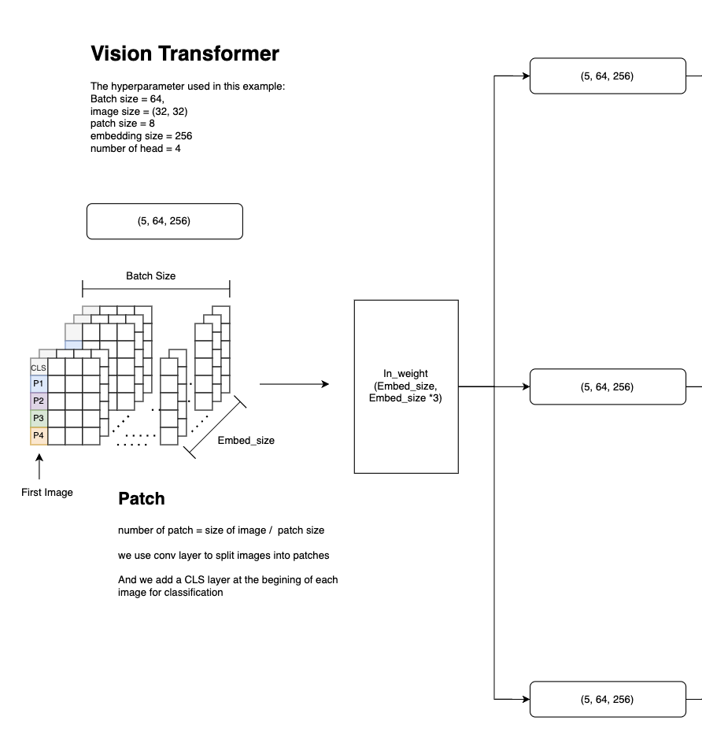
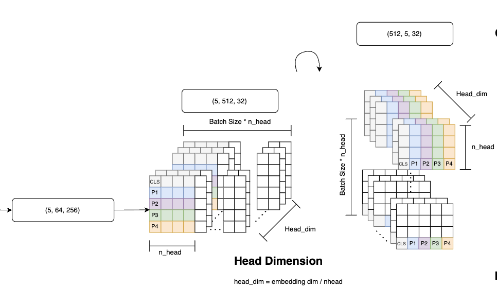
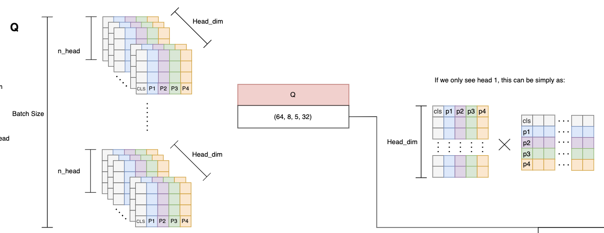
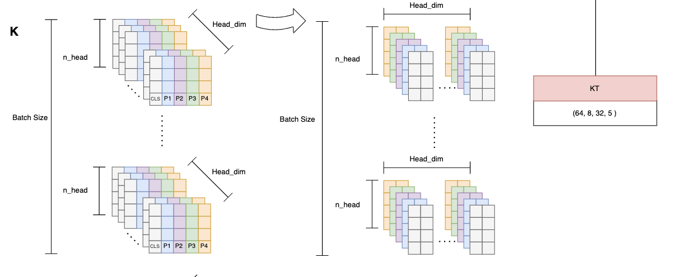

# Vision Transformer

In this repository, we present our from-scratch implementation of the Vision Transformer (ViT), a breakthrough architecture for image classification tasks that relies on transformer structures traditionally used in NLP.

**Overview**

The Vision Transformer works by first splitting an image into fixed-size patches and then linearly embedding them into a sequence of vectors. These vectors are then processed by a series of Transformer blocks, specifically the multi-head self-attention mechanism, to generate global feature representations for classification.

## Process Breakdown

### Splitting Image into Patches

The first step involves dividing the image into non-overlapping patches of fixed size. Each patch is then linearly embedded to generate a flat vector representation.

### Multi-head Self-Attention Mechanism

The embedded patches are then processed through the multi-head self-attention mechanism of the Transformer. This step allows the model to capture both local and global image dependencies.

#### Query (Q) Matrix

The Query matrix is responsible for determining the relationship context for each patch in relation to others.

#### Key (K) Matrix

The Key matrix matches the Query matrix against all other patches to weigh their importance.

